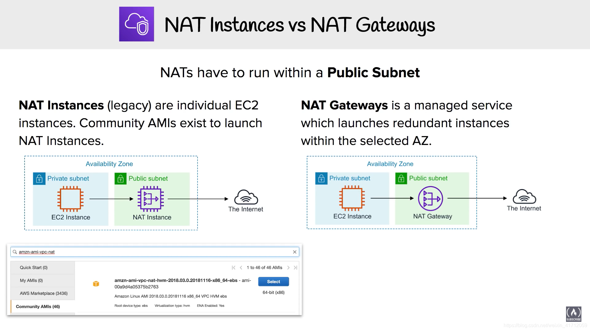

https://youtu.be/ydxEeVAqVdo?si=oeaQOZuOEZuKaHvX

# 1 NAT Gateway

## 1.1 理论 

private Subnet can not download packages form internet 

从内部经过 NAT Gateway 访问互联网是可能的 

从外部经过 NAT Gateway 是不可能的

### 1.1.1 Setup process

1 create VPC
2 create private subnet and public subnet within VPC 
4 create Internet gateway
3 create route table, attach internet gateway to route table , so that the public Subnet can connect to internet Gateway 

4 create NAT Gateway
==NAT Gateway will be associated with our public subnet with the internet gateway, because the internet gateway is only available inside our public subnet 
NAT Gateway will provide a route to the private subnet to get an internet access ==

NAT Gateway 需要被安置在 public subnet 中 

绑定 一个 public subnet 

connectivity type 
应该选 public 
Private:  用这个话 ec2 instance in private subnet 只能连接到 其他的 VPC, 不能连接到 internet 

create Elastic ip addresse 

add tags 

5 update the route table in private subnet 
so the private subnet can connect to NAT Gateway 

6 create Ec2 instance in public subnet and private subnet 
在创造 EC2 instance 的时候， 就顺便把 security group 给创造了 

 看到 private EC2 Instance 没有 public ip addresse , 只有 private ipv4 addresse. 所以 无法送互联网直接访问 这个 instance 
 (auto-assign publoic IP 选为 Disable)
 
 
 

### 1.1.2 test the NAT Gateway 

login ec2 instance in public subnet , then 在 这个 ec2 instance 中 去 login the ec2 instance in private subnet 。 因为 the ec2 instance in private subnet 无法直接从 internet 中访问 

在 private ec2 instance 的属性页面， 可以看到 在 public ec2 instance 中 使用 `ssh -i "nat-gateway-demo-key.pem" ubuntu@12.0.2.98 `  就可以连接到 private ec2 instance 了 

# 2 NAT Instance 

A NAT instance provides network address translation (NAT). You can use a NAT instance to allow resources in a private subnet to communicate with destinations outside the virtual private cloud (VPC), such as the internet or an on-premises network. The resources in the private subnet can initiate outbound IPv4 traffic to the internet, but they can't receive inbound traffic initiated on the internet.

# 3 NAT Instance 和 NAT Gateway 的不同 

Amazon Web Services (AWS) offers two options for implementing Network Address Translation (NAT) in a Virtual Private Cloud (VPC) — NAT Gateway and NAT Instance.

NAT Gateway is a fully managed service that allows outbound internet access for instances in a private subnet. It automatically scales to handle the increased traffic that your instances generate, and it does not require you to patch or monitor it.

A NAT Instance, on the other hand, is a custom EC2 instance that you set up and configure to perform NAT. This option gives you more control over the instance, such as the ability to use your own AMI, but also requires you to handle scaling, patching, and monitoring the instance.

----

One key difference between the two is that NAT Gateway provides a higher level of availability, as it automatically scales and is distributed across multiple availability zones, while a NAT Instance is a single point of failure. Additionally, NAT Gateway has a higher throughput, making it better suited for handling high traffic loads.

Another important consideration is the cost difference. NAT Gateway has a hourly usage cost, and also data processing charges, while NAT Instance will have the costs of the EC2 instance running and data processing charges.

In conclusion, if you need a highly available and scalable NAT solution that can handle high traffic loads, NAT Gateway is the better option. If you prefer more control over the instance and are comfortable handling scaling, patching, and monitoring, a NAT Instance may be a better choice. It’s important to evaluate your use case and determine which option is best for your specific needs.

属性 	NAT 网关 	NAT 实例
可用性 	高度可用。每个可用区中的 NAT 网关都采用冗余实施。在每个可用区中创建一个 NAT 网关可确保架构不依赖于可用区。 	使用脚本管理实例之间的故障转移。
带宽 	可以扩展到 45 Gbps。 	取决于实例类型的带宽。
维护 	由Amazon管理。您不需要进行任何维护。 	由您管理，例如您需要对实例安装软件更新或操作系统补丁。
性能 	软件经过优化以便处理 NAT 流量。 	配置来执行 NAT 的通用 Amazon Linux AMI。
费用 	费用取决于您使用的 NAT 网关的数量、使用时长以及您通过 NAT 网关发送的数据量。 	费用取决于您使用的 NAT 实例的数量、使用时长以及实例类型和大小。
类型和大小 	整合提供；您不需要选择类型或范围。 	根据您的预测工作负载选择适当的实例类型和大小。

----

Another important factor to consider when choosing between a NAT Gateway and a NAT Instance is security. NAT Gateway uses the Amazon VPC firewall to control inbound and outbound traffic, providing an additional layer of security for your VPC. A NAT Instance, on the other hand, relies on the security group of the EC2 instance to control traffic, which may not provide the same level of security as the VPC firewall.

When it comes to monitoring and logging, NAT Gateway provides detailed metrics and logs through CloudWatch and VPC Flow Logs. These logs can be used to monitor traffic patterns, troubleshoot connectivity issues, and ensure compliance with regulatory requirements. A NAT Instance, on the other hand, requires manual monitoring and logging, which can be time-consuming and may not provide the same level of visibility into the traffic patterns in your VPC.

In terms of ease of use, NAT Gateway is a fully managed service that requires minimal configuration, while a NAT Instance requires manual setup and ongoing maintenance. This means that with NAT Gateway, you don’t need to worry about scaling, patching, or monitoring the NAT service, and you can focus on running your applications. With a NAT Instance, you’ll need to handle these tasks yourself, which can be time-consuming and may take away resources from other projects.

In conclusion, NAT Gateway and NAT Instance are two different options for implementing Network Address Translation in a VPC. While NAT Gateway is a fully managed service that provides high availability and scalability, it can be a bit more expensive. A NAT Instance, on the other hand, gives you more control over the instance, but requires manual setup and ongoing maintenance. Ultimately, the best option for you will depend on your specific use case, budget, and security requirements.

