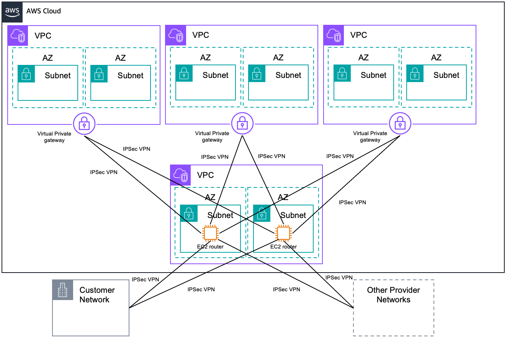

# 1 transit VPC

https://docs.aws.amazon.com/whitepapers/latest/aws-vpc-connectivity-options/transit-vpc-option.html

Building on the Software VPN designs mentioned above, you can create a global transit network on AWS. 
==A transit VPC is a common strategy for connecting multiple, geographically disperse VPCs and remote networks in order to create a global network transit center. ==
 
A transit VPC simplifies network management and minimizes the number of connections required to connect multiple VPCs and remote networks. The following figure illustrates this design. 

