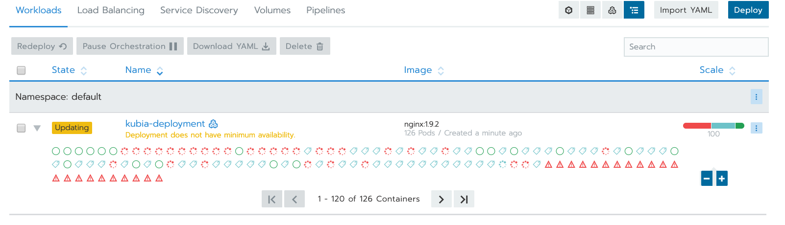
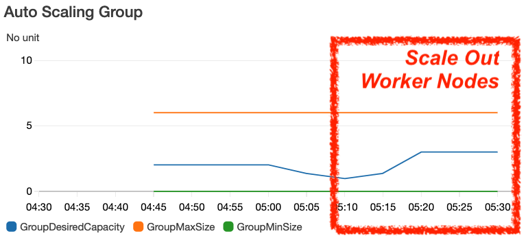
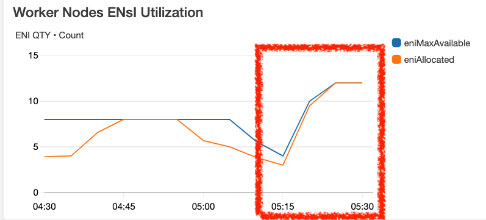
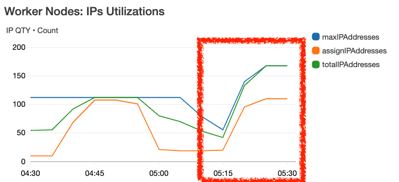

# 1 EKS network architecture 


# 2 VPC Consideration

使用 EKS 之前，必須先考慮 VPC 的規劃，相關 VPC 規劃概念可以參考底下兩篇整理：
- [Study Notes - Virtual Private Cloud (VPC)](https://rickhw.github.io/2016/02/21/AWS/Study-Notes-VPC/)
- [Plan and Design Multiple VPCs in Different Regions](https://rickhw.github.io/2017/07/07/AWS/Plan-And-Deisgn-Multiple-VPCs-in-Different-Regions/)

本文分成以下兩個情境：`個人測試`、`有串接 VPN 的企業`

如果是個人測試、或者公司沒有串接 VPN，建議至少有以下配置：
- Public Subnets: 放 Master Nodes 或 Worker Nodes
- Private Subnets: 放 Worker Nodes，如果都使用 Public Subnet 就不需要了。

如果是在有串接 VPN 的企業內部，建議都放在 Private Subnets，Ingress 也是放在 Private Subnet ，然後透過 ALB / CLB 開放給外部。

EKS 會直接使用 [VPC CNI](https://github.com/aws/amazon-vpc-cni-k8s) ，換言之每個 POD 都會配給 VPC 的 IP，如果會大量的開 POD，那麼就要注意 Subnet IP 的的使用狀況。依照這篇 [Elastic Network Interfaces](https://docs.aws.amazon.com/AWSEC2/latest/UserGuide/using-eni.html) 的整理，不同 EC2 Instance Type 可以使用的 ENI 有其數量限制，而可以使用的 IPv4 Address 又有限制。舉例來說：

- t2.large: 最多 3 ENIs, 每張 12 個 IP，所以最多只能開 36 個 PODs
- c5.large: 最多 3 ENIs, 每張 10 個 IP，所以最多只能開 30 個 PODs
- c5.xlarge: 最多 4 ENIs, 每張 15 個 IP，所以最多只能開 60 個 PODs
- m5.large: 最多 3 ENIs, 每張 10 個 IP，所以最多只能開 30 個 PODs
- m5.xlarge: 最多 4 ENIs, 每張 15 個 IP，所以最多只能開 60 個 PODs
- …

所以要考慮的幾個點：

- 可用的 IP 數量 與 Subnets CIDR 規劃
    - Worker Node 使用 IP 數會非常驚人，所以一定要留意 IP 的數量。
    - 如果不夠用，可以單獨規劃 VPC 或者使用 VPC Expending 功能擴展 CIDR。
- Master Node 是否允許外部存取？或者說透過外部存取？
    - 如果是作 Lab 可以都允許 Public Access
- Worker Node 是否允許外部存取？
    - 通常依 Ingress 設計決定。
- 是否需要隔離 namespace 管控？或者做 Firewall (Security Group)？
    - 如果是 Multiteleant 架構就會需要考慮
    - 隔離性一直以來是 VPC 規劃的重點，同樣的概念，在 K8s 也是。


## 2.1 VPC-CNI Utilization：如何監控 ENI 與 IP Address 使用狀況

參考 [CNI Metrics Helper](https://docs.aws.amazon.com/eks/latest/userguide/cni-metrics-helper.html) 。主要確認 IAM 權限、然後 apply 即可。
- ENI 使用狀況
    - Cluster 最多有多少個 ENI 可以使用
    - 已經配置多少 ENI
- IPs 使用狀況
    - 總共有多少可用 IPs
    - ENI 已經配置多少個 pod
    - 目前已經有多少個 IPs 配給 pods 了
- 有多少 ipamD errors


底下實驗：
- Worker Nodes 是兩台 c5.xlarge，依據文件的描述 [Elastic Network Interfaces](https://docs.aws.amazon.com/AWSEC2/latest/UserGuide/using-eni.html) 的計算出 c5.xlarge:
    - 最多 4 ENIs
    - 每張 15 個 IP，最多 60 個 IP，只能開 60 個 PODs
- 兩台最多
    - Max ENIs: 4 * 2 = 8
    - Max IPs: 60 * 2 = 120

驗證上述屬實，c5.xlarge 的 ENI & IPs 數字文件所描述，如下圖：


\
實際算過，每台 c5.xlarge 如文件所描述是：4 ENIs, 60 IPs

我嘗試跑一個簡單的 AP, 讓 pod 長到 100 個



扣除 kube-* 在使用的、第一張 eth0 使用的，實際上每台能使用的有 112 個 IPs，得到以下的圖：


# 3 Cluster AutoScaler

承上，如果 pod 的資源不夠了，例如 IP 不夠用，如何觸發 Worker Nodes 的 ASG？上一個問題中，有兩台 Worker Nodes，當長到 100 pod 時，其中有一些 pods 因為沒有 IP 可以使用，如下圖，這時候如觸發 ASG 自動 Scale Out？


K8s 的解法：[Cluster Autoscaler](https://docs.aws.amazon.com/eks/latest/userguide/cluster-autoscaler.html) 。步驟大概如下：
1. 設定 Worker Node 的權限，主要是讓他可以對 ASG 操作，另外記得打開 ASG CloudWatch Metrics。

```
{  
    "Version": "2012-10-17",  
    "Statement": [  
        {  
            "Action": [  
                "autoscaling:DescribeAutoScalingGroups",  
                "autoscaling:DescribeAutoScalingInstances",  
                "autoscaling:DescribeLaunchConfigurations",  
                "autoscaling:DescribeTags",  
                "autoscaling:SetDesiredCapacity",  
                "autoscaling:TerminateInstanceInAutoScalingGroup",  
                "ec2:DescribeLaunchTemplateVersions"  
            ],  
            "Resource": "*",  
            "Effect": "Allow"  
        }  
    ]  
}
```

2. 依序執行以下：
```
## 部署 cluster-autoscaler  
kubectl apply -f https://raw.githubusercontent.com/kubernetes/autoscaler/master/cluster-autoscaler/cloudprovider/aws/examples/cluster-autoscaler-autodiscover.yaml  
  
## 修改 annotate  
kubectl -n kube-system \  
    annotate deployment.apps/cluster-autoscaler cluster-autoscaler.kubernetes.io/safe-to-evict="false"  
  
  
## 指定 image 版本, 要與 k8s 版本符合，本實驗的 k8s 是 1.14.6，所以使用 1.14.x  
kubectl -n kube-system \  
    set image deployment.apps/cluster-autoscaler \  
    cluster-autoscaler=k8s.gcr.io/cluster-autoscaler:v1.14.6
```

3. 綁定 autoscaler 與 ASG 的關聯，執行 `kubectl -n kube-system edit deployment.apps/cluster-autoscaler`，找到以下做修改，其中 `<YOUR CLUSTER NAME>` 換成 EKS Cluster Name
```
spec:  
  containers:  
  - command:  
    - ./cluster-autoscaler  
    - --v=4  
    - --stderrthreshold=info  
    - --cloud-provider=aws  
    - --skip-nodes-with-local-storage=false  
    - --expander=least-waste  
    - --node-group-auto-discovery=asg:tag=k8s.io/cluster-autoscaler/enabled,k8s.io/cluster-autoscaler/<YOUR CLUSTER NAME>  
    - --balance-similar-node-groups  
    - --skip-nodes-with-system-pods=false
```

4. 查詢 log: `kubectl -n kube-system logs -f deployment.apps/cluster-autoscaler`


## 3.1 Scale Out

接下來試著把 pod 的數量長到很極端，這裡的範例是：

- worker node: c5.xlarge x 1
- pod: 10

把 pod 的數量調整成 `100`，觀察 `deployment.apps/cluster-autoscaler` 的狀況，會發現類似底下訊息：
```
I1019 05:18:40.633616       1 static_autoscaler.go:138] Starting main loop  
I1019 05:18:40.633940       1 utils.go:595] No pod using affinity / antiaffinity found in cluster, disabling affinity predicate for this loop  
I1019 05:18:40.634385       1 scale_up.go:266] 61 other pods are also unschedulable  
I1019 05:18:40.634526       1 scale_up.go:300] Upcoming 2 nodes  
I1019 05:18:40.638407       1 scale_up.go:408] No need for any nodes in K8s-EKS-v114-WorkerNode-t2.large-20191013  
I1019 05:18:40.638424       1 scale_up.go:416] No expansion options
```

這時候觀察 ASG 的 Metrics，如下分別是 Worker Nodes 的 Instance Count、ENIs QTY、IP QTY







## 3.2 Scale In

長出去的機器，當然要自動收回來，把 pod 的數量調降回 10 個，不過無法正常運作，遇到以下問題：

> Failed to regenerate ASG cache: cannot autodiscover ASGs: RequestError: send request failed


cluster-autoscaler 的 log:
```
I1019 05:58:09.678245       1 static_autoscaler.go:138] Starting main loop  
I1019 05:58:15.083305       1 reflector.go:370] k8s.io/client-go/informers/factory.go:132: Watch close - *v1.Node total 18 items received  
I1019 05:59:23.290859       1 reflector.go:370] k8s.io/client-go/informers/factory.go:132: Watch close - *v1beta1.PodDisruptionBudget total 0 items received  
I1019 05:59:37.183316       1 reflector.go:370] k8s.io/client-go/informers/factory.go:132: Watch close - *v1.ReplicationController total 0 items received  
I1019 05:59:48.378083       1 reflector.go:370] k8s.io/autoscaler/cluster-autoscaler/utils/kubernetes/listers.go:215: Watch close - *v1.Pod total 0 items received  
I1019 05:59:48.394497       1 reflector.go:370] k8s.io/autoscaler/cluster-autoscaler/utils/kubernetes/listers.go:253: Watch close - *v1.Node total 27 items received  
I1019 06:00:06.291909       1 reflector.go:370] k8s.io/autoscaler/cluster-autoscaler/utils/kubernetes/listers.go:319: Watch close - *v1.DaemonSet total 0 items received  
E1019 06:00:10.278115       1 aws_manager.go:259] Failed to regenerate ASG cache: cannot autodiscover ASGs: RequestError: send request failed  
caused by: Post https://autoscaling.us-west-2.amazonaws.com/: dial tcp: i/o timeout  
E1019 06:00:10.278134       1 static_autoscaler.go:158] Failed to refresh cloud provider config: cannot autodiscover ASGs: RequestError: send request failed  
caused by: Post https://autoscaling.us-west-2.amazonaws.com/: dial tcp: i/o timeout  
I1019 06:00:10.278145       1 metrics.go:269] Function main took 2m0.59991858s to complete  
I1019 06:00:18.290439       1 reflector.go:370] k8s.io/autoscaler/cluster-autoscaler/utils/kubernetes/listers.go:359: Watch close - *v1.StatefulSet total 0 items received
```

到 pod 裡檢查，發現無法反查 DNS
```
~$ k exec -it cluster-autoscaler-db8ccb5d5-fc65n -n kube-system sh  
# ping cluster-autoscaler-db8ccb5d5-fc65n  
PING cluster-autoscaler-db8ccb5d5-fc65n (172.31.0.175) 56(84) bytes of data.  
64 bytes from cluster-autoscaler-db8ccb5d5-fc65n (172.31.0.175): icmp_seq=1 ttl=255 time=0.018 ms  
64 bytes from cluster-autoscaler-db8ccb5d5-fc65n (172.31.0.175): icmp_seq=2 ttl=255 time=0.021 ms  
^C  
--- cluster-autoscaler-db8ccb5d5-fc65n ping statistics ---  
2 packets transmitted, 2 received, 0% packet loss, time 1067ms  
rtt min/avg/max/mdev = 0.018/0.019/0.021/0.004 ms  
# ping autoscaling.us-west-2.amazonaws.com  
^C  
# cat /etc/resolv.conf  
nameserver 10.100.0.10  
search kube-system.svc.cluster.local svc.cluster.local cluster.local us-west-2.compute.internal  
options ndots:5  
# ping autoscaling.us-west-2.amazonaws.com  
^C  
# ping 8.8.8.8  
PING 8.8.8.8 (8.8.8.8) 56(84) bytes of data.  
64 bytes from 8.8.8.8: icmp_seq=1 ttl=42 time=7.14 ms  
64 bytes from 8.8.8.8: icmp_seq=2 ttl=42 time=7.11 ms  
^C  
--- 8.8.8.8 ping statistics ---  
2 packets transmitted, 2 received, 0% packet loss, time 1001ms  
rtt min/avg/max/mdev = 7.117/7.132/7.147/0.015 ms  
# ping www.google.com
```


# 4 worker nodes 层面


ENI: elastic network interface, 网卡 
CNI: Container network interface, 容器网络接口 

给每一个Pod 一个 cidr range, 这个 cider range 是放到 warm poll 中的 

## 4.1 CNI Plugin 

Every container get its own IP address (CNI-VPC Plugin)


## 4.2 CNI 的介绍 


## 4.3 aws-node


L-IPAM: local ip adress management 

把一些ip block 分给不同的worker上面 


CNI-Plugin 和 L-IPAM直接的通信 是通过 gRPC 


# 5 amazon-vpc-cni-k8s 插件

给每个 pod 配上一个vpc 中的 真实的物理地址
这样的话 pod 之间的通讯 ， 就可以 实现高效网络地址， 这样在 eks 就不需要虚拟的网络层了，


