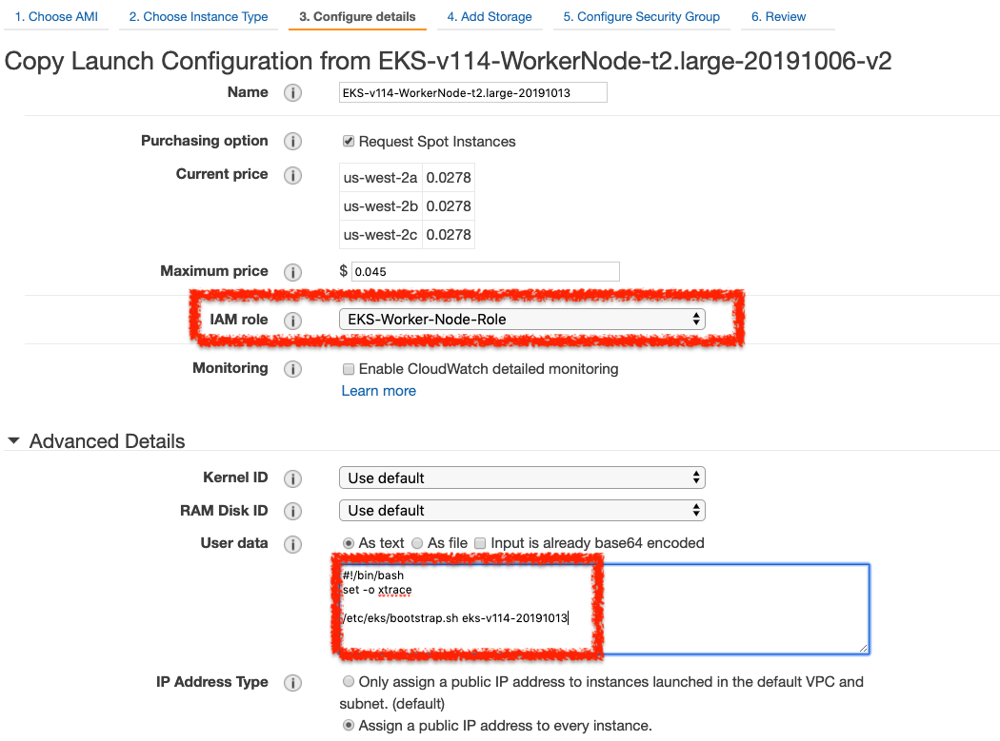
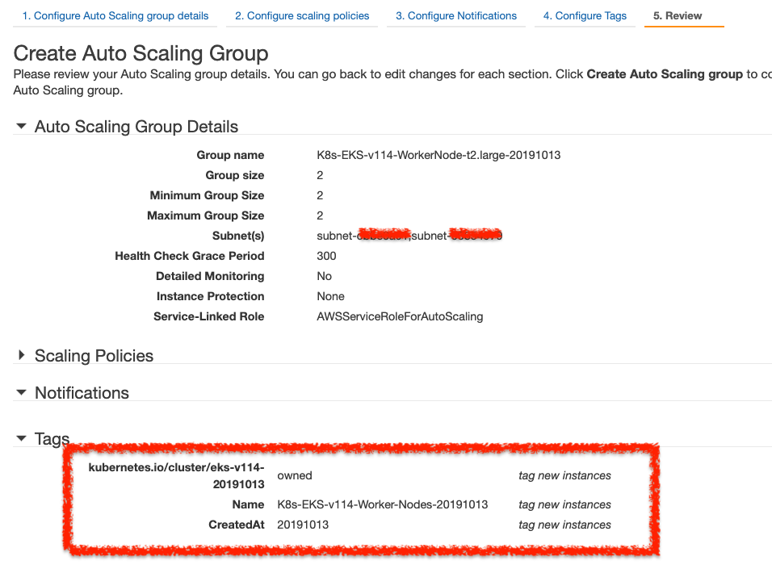

如同之前提及，雖然 EKS 是 Managed Service，但是實際上只有針對 Master Nodes，而 Worker Nodes 還是需要自行管理以及維護的，另外針對 Ingress、使用者權限、Log 蒐集、資源監控、網路 (CNI 相關) … 等，還是需要額外規劃。

筆記內容：

1. 準備: IAM User, IAM Role, VPC Subnets
2. 建置: EKS Master Nodes, ConfigMap, CNI, Worker Nodes
3. Q and A


# 1 準備 (Preparation)

使用 EKS 有幾件事情要先準備、規劃的，主要是 VPC 還有權限部分。

## 1.1 準備工具

先準備以下工具：
1. `awscli`: 本文以 `awscli` 為主，版本至少要 `1.16.232` 以上才可以。
2. `kubectl`: 安裝 1.14 以上版本
3. `aws-iam-authenticator` (optional): 非必要, 如果 awscli 版本在 1.16.232 以下，那就需要

底下筆記安裝過程，建議開一台乾淨的 Linux 安裝，避免本機環境不乾淨，造成後續安裝問題：
```
## 1. 安裝 awscli  
pip install awscli  
  
~$ aws --version  
aws-cli/1.16.253 Python/3.5.2 Linux/4.4.0-1095-aws botocore/1.12.243  
  
## 2. 安裝 kubectl: for linux  
~$ curl -LO https://storage.googleapis.com/kubernetes-release/release/`curl -s https://storage.googleapis.com/kubernetes-release/release/stable.txt`/bin/linux/amd64/kubectl  
~$ chmod +x ./kubectl  
~$ mv ./kubectl /usr/local/bin/kubectl  
~$ kubectl version --short --client  
Client Version: v1.16.1  
  
## 安裝 kubectl: for macOS  
#curl -o kubectl https://amazon-eks.s3-us-west-2.amazonaws.com/1.14.6/2019-08-22/bin/darwin/amd64/kubectl  
#~$ kubectl version --short --client  
  
## 3. 安裝 aws-iam-authenticator  
## see: https://github.com/kubernetes-sigs/aws-iam-authenticator  
~$ curl -o aws-iam-authenticator https://amazon-eks.s3-us-west-2.amazonaws.com/1.14.6/2019-08-22/bin/linux/amd64/aws-iam-authenticator  
~$ chmod +x ./aws-iam-authenticator  
~$ sudo mv aws-iam-authenticator /usr/local/bin  
~$ aws-iam-authenticator version --short  
Version: v0.4.0  
Commit: c141eda34ad1b6b4d71056810951801348f8c367
```


## 1.2 VPC Consideration

相關 VPC 規劃的考量，參閱：[EKS 學習筆記 - 網路規劃與管理篇](https://rickhw.github.io/2019/10/19/AWS/Study-Notes-EKS_Networking/)

建置 EKS Cluster 準備以下資訊：
- Subnet IDs: `subnet-1234567,subnet-1234568`
- Security Groups: `sg-1234567890123456`

## 1.3 規劃權限

準備以下身份給 K8s Cluster 使用：
- IAM User `au-eks-admin`: 用來建立 EKS Cluster 的 IAM 身份
- IAM Roles: 
    - `K8s-Master-Node-Role`: Master Node 的身份，提供以下的 Policies:
        - `AmazonEKSClusterPolicy`
        - `AmazonEKSServicePolicy`
    - `K8S-Worker-Node-Role`: Worker Node 的身份，提供以下的 Policies:
        - `AmazonEKSWorkerNodePolicy`
        - `AmazonEC2ContainerRegistryReadOnly`
        - `AmazonEKS_CNI_Policy`

## 1.4 config.sh

前述的資訊，整理成以下的 Scripts 當作，底下的資訊都是範例，記得改成自己需要的，後續的動作都會假設這些變數已經初始化。
```
## IAM Profile  
AWS_DEFAULT_PROFILE="au-eks-admin"  
AWS_DEFAULT_REGION="us-west-2"  


## K8S info  
K8S_CLUSTER_NAME="eks-v114-20191013"  
K8S_VERSION="1.14"  

  
## IAM ROLES  
K8S_MASTER_NODE_ROLE_ARN="arn:aws:iam:::role/K8S-Master-Node-Role"  
K8S_WORKER_NODE_ROLE_ARN="arn:aws:iam:::role/K8S-Worker-Node-Role"  


# VPC: Subnet, Security Groups  
K8S_WORKER_SUBNETS="subnet-12345678,subnet-12345679"  
K8S_WORKER_SECURITY_GROUPS="sg-1234567890123456"
```


# 2 建置 (Provisioning)

建置過程的執行身份要特別注意，否則問題會很多。底下的範例都是使用 `au-eks-admin` 這個身份執行。


## 2.1 建置 Master Nodes

直接建立一個 EKS Cluster，底下的配置包含指定 Cluster Name, IAM Role, VPC, Region, Profile 等資訊。
```
## 1. 建立 EKS Cluster  
aws eks create-cluster \  
    --name ${K8S_CLUSTER_NAME} \  
    --role-arn ${K8S_MASTER_NODE_ROLE_ARN} \  
    --resources-vpc-config subnetIds=${K8S_WORKER_SUBNETS},securityGroupIds=${K8S_WORKER_SECURITY_GROUPS},endpointPublicAccess=true,endpointPrivateAccess=true \  
    --kubernetes-version ${K8S_VERSION} \  
    --region ${AWS_DEFAULT_REGION} \  
    --profile ${AWS_DEFAULT_PROFILE}
```


執行下去會看到以下的輸出：
```
{  
    "cluster": {  
        "name": "eks-v114-20191006",  
        "version": "1.14",  
        "roleArn": "arn:aws:iam::123456789012:role/K8S_MASTER_NODE_ROLE_ARN",  
        "certificateAuthority": {},  
        "createdAt": 1570342594.516,  
        "status": "CREATING",  
        "arn": "arn:aws:eks:us-west-2:123456789012:cluster/eks-v114-20191013",  
        "platformVersion": "eks.1",  
        "resourcesVpcConfig": {  
            "endpointPublicAccess": true,  
            "subnetIds": [  
                "subnet-12345678",  
                "subnet-12345679"  
            ],  
            "vpcId": "vpc-1234567",  
            "securityGroupIds": [  
                "sg-1234567890123456"  
            ],  
            "endpointPrivateAccess": true  
        }  
    }  
}
```


接下來要等待大約十分鐘的時間，可以透過以下 CLI 取得 Cluster 狀態
```
## Status  
aws eks describe-cluster \  
    --region ${AWS_DEFAULT_REGION} \  
    --name ${K8S_CLUSTER_NAME} \  
    --query cluster.status  
  

"CREATING"  


# 大約等十到十五分鐘  


"ACTIVE"
```


### 2.1.1 配置 kubeconfig

使用以下 cli 產生 kubeconfig：

```
aws eks update-kubeconfig \  
    --role-arn ${K8S_MASTER_NODE_ROLE_ARN} \  
    --name ${K8S_CLUSTER_NAME} \  
    --region ${AWS_DEFAULT_REGION} \  
    --profile ${AWS_DEFAULT_PROFILE} \  
    --kubeconfig "${HOME}/.kube/config_${K8S_CLUSTER_NAME}"  
  
echo "copy and paste following to export KUBECONFIG:"  
echo "    export KUBECONFIG=${HOME}/.kube/config_${K8S_CLUSTER_NAME}"
```

請把 `${HOME}/.kube/config_${K8S_CLUSTER_NAME}` 檔案裡的 `env`、`role` 部份都註解掉，如下：

新版的 awscli 產生如下：
```
users:  
- name: arn:aws:eks:us-west-2:123456789012:cluster/eks-v114-20191013  
  user:  
    exec:  
      apiVersion: client.authentication.k8s.io/v1alpha1  
      args:  
      - --region  
      - us-west-2  
      - eks  
      - get-token  
      - --cluster-name  
      - eks-v114-20191013  
#      - --role  
#      - arn:aws:iam::123456789012:role/K8S-Master-Node-Role  
      command: aws  
#      env:  
#      - name: AWS_PROFILE  
#        value: gtcafe-dev.au-eks-admin
```


舊版的 awscli
```
users:  
- name: arn:aws:eks:us-west-2:123456789012:cluster/eks-v114-20191013  
  user:  
    exec:  
      apiVersion: client.authentication.k8s.io/v1alpha1  
      args:  
      - token  
      - -i  
      - eks-v114-20191013  
#      - -r  
#      - arn:aws:iam::123456789012:role/K8S-Master-Node-Role  
      command: aws-iam-authenticator  
#      env:  
#      - name: AWS_PROFILE  
#        value: gtcafe-dev.au-eks-admin
```


### 2.1.2 確認 Cluster Status

取得現在的 nodes 狀態：

```
## 看不到任何 Nodes  
~$ kubectl get nodes -o wide  
No resources found.  
  
## 取得所有的 ComponentStatuses  
~$ kubectl get cs --all-namespaces  
NAME                 STATUS    MESSAGE             ERROR  
controller-manager   Healthy   ok  
scheduler            Healthy   ok  
etcd-0               Healthy   {"health":"true"}  
  
## 取得 Services, Pods  
~$ kubectl get svc,po --all-namespaces  
NAMESPACE     NAME                 TYPE        CLUSTER-IP    EXTERNAL-IP   PORT(S)         AGE  
default       service/kubernetes   ClusterIP   10.100.0.1    <none>        443/TCP         17m  
kube-system   service/kube-dns     ClusterIP   10.100.0.10   <none>        53/UDP,53/TCP   17m  
  
NAMESPACE     NAME                           READY   STATUS    RESTARTS   AGE  
kube-system   pod/coredns-6f647f5754-5zdwb   0/1     Pending   0          17m  
kube-system   pod/coredns-6f647f5754-9xcl2   0/1     Pending   0          17m
```


## 2.2 配置 ConfigMap for EKS Authentification


### 2.2.1 join a worker node with master node 

主要是提供一個 IAM Role 的身份讓 Master Cluster 去管理。修改以下 `aws-auth-cm.yaml` 黨，把其中的 `<ARN of instance role (not instance profile)>` 置換成 Worker Nodes 的 ARN，其他不要動。


aws-auth-cm.template.yaml
```
apiVersion: v1  
kind: ConfigMap  
metadata:  
  name: aws-auth  
  namespace: kube-system  
data:  
  mapRoles: |  
    - rolearn: <ARN of instance role (not instance profile)>  
      username: system:node:{{EC2PrivateDNSName}}  
      groups:  
        - system:bootstrappers  
        - system:nodes
```

- `mapRoles`: 映射一个 IAM **角色** 到 Kubernetes 中的用户和组。
- `rolearn`: 你需要填的是 EC2 实例的 IAM **角色的 ARN**（注意：**不是 Instance Profile 的 ARN**）。
- `username`: 定义这个 IAM 实例在 Kubernetes 中的名字。EKS 会用这个名字标识 node（EC2）。
    - `{{EC2PrivateDNSName}}` 是一个变量，占位符，EKS 会自动替换为该节点的私有 DNS 名称。
- `groups`: 是这个角色所属于的 Kubernetes **权限组**：
    - `system:bootstrappers`：用于 kubelet 启动阶段
    - `system:nodes`：允许 kubelet 以 node 身份与 kube-apiserver 通信


直接執行 kubectl apply -f aws-auth-cm.yaml，如下：
```
~$ kubectl apply -f aws-auth-cm.yaml  
configmap/aws-auth created  
  
~$ kubectl describe configmap -n kube-system aws-auth  
Name:         aws-auth  
Namespace:    kube-system  
Labels:       <none>  
Annotations:  kubectl.kubernetes.io/last-applied-configuration:  
                {"apiVersion":"v1","data":{"mapRoles":"- rolearn: arn:aws:iam::123456789012:role/EKS-Worker-Node-Role\n  username: system:node:{{EC2Privat...  
  
Data  
====  
mapRoles:  
----  
- rolearn: arn:aws:iam::123456789012:role/EKS-Worker-Node-Role  
  username: system:node:{{EC2PrivateDNSName}}  
  groups:  
    - system:bootstrappers  
    - system:nodes  
  
Events:  <none>
```


到此 Master Node 已經完成準備。


### 2.2.2 修改并添加 IAM 用户或角色


获取现有 `aws-auth` 配置
kubectl get configmap aws-auth -n kube-system -o yaml

修改并添加 IAM 用户或角色
你贴出的这段是 `aws-auth` ConfigMap 中的 `mapUsers` 配置，用于将一个 IAM 用户映射到 Kubernetes 中的用户并赋予权限。
```
mapUsers: |
  - userarn: arn:aws:iam::123456789012:user/your-iam-user
    username: your-k8s-user
    groups:
      - system:masters
```

- **`userarn`**: 指向你在 IAM 中的用户 ARN，比如 `arn:aws:iam::123456789012:user/alice`
- **`username`**: 映射为 Kubernetes 中的用户名，可以自定义
- **`groups`**:    
    - `system:masters`: 这个组是 **集群管理员组**，拥有 `cluster-admin` 的全部权限（⚠️ 非常高权限）

## 2.3 CNI

EKS 不用特別配置 CNI，建置起來就會準備好 DaemonSet，可以透過了解 `aws-node` 的配置，可以知道相關資訊以及 VPC CNI 的配置，如下：

```
~$ kubectl describe daemonset aws-node --namespace kube-system | grep Image | cut -d "/" -f 2  
    amazon-k8s-cni:v1.5.4  
  
~$ kubectl describe daemonset aws-node --namespace kube-system | grep Image  
    Image:      602401143452.dkr.ecr.us-west-2.amazonaws.com/amazon-k8s-cni:v1.5.4  
  
## Find CNI Config Variable, see: https://github.com/aws/amazon-vpc-cni-k8s  
~$ kubectl edit daemonset -n kube-system aws-node
```

## 2.4 建置WorkerNodes

這邊使用手動建立 Worker Nodes，步驟大概如下：
1. 找到 AWS 提供的 Woker Node AMI-ID，參考 [Amazon EKS-Optimized Linux AMI](https://docs.aws.amazon.com/eks/latest/userguide/eks-optimized-ami.html) , 也可以透過 SSM 取得
2. 建立 Launch Configuration
3. 建立 EC2 Auto Scaling Group

> 也可以使用 CloudFormation，下載這份 [template](https://amazon-eks.s3-us-west-2.amazonaws.com/cloudformation/2019-02-11/amazon-eks-nodegroup.yaml) 即可。


### 2.4.1 建立 Launch Configuration

建立一個 LC，如下圖：




其中 User Data 填入以下，注意 `EKS-CLUSTER-NAME` 記得修改。
```
#!/bin/bash  
set -o xtrace  
  
# /etc/eks/bootstrap.sh {EKS-CLUSTER-NAME}  
/etc/eks/bootstrap.sh eks-v114-20191013
```


### 2.4.2 建立 EC2 ASG

建立一個 EC2 ASG，使用前面建立的 LC，如下圖。===特別注意的是 Tag 必續指定如下===：
- Key: `kubernetes.io/cluster/<CLUSTER_NAME>`, Value: `owned` 

如果沒有指定，Worker Node 就無法加入 Cluster。



順利的話，執行以下就可以看到 Nodes 的狀態了。
```
## 取得 Nodes  
~$ kubectl get no  
NAME                                         STATUS   ROLES    AGE     VERSION  
ip-172-31-0-198.us-west-2.compute.internal   Ready    <none>   3m51s   v1.14.7-eks-1861c5  
ip-172-31-5-6.us-west-2.compute.internal     Ready    <none>   3m58s   v1.14.7-eks-1861c5  
  
## 取得所有的 Pod  
~$ kubectl get svc,po --all-namespaces  
NAMESPACE     NAME                 TYPE        CLUSTER-IP    EXTERNAL-IP   PORT(S)         AGE  
default       service/kubernetes   ClusterIP   10.100.0.1    <none>        443/TCP         65m  
kube-system   service/kube-dns     ClusterIP   10.100.0.10   <none>        53/UDP,53/TCP   65m  
  
NAMESPACE     NAME                           READY   STATUS    RESTARTS   AGE  
kube-system   pod/aws-node-jmt6l             1/1     Running   0          8m3s  
kube-system   pod/aws-node-w94hd             1/1     Running   0          8m10s  
kube-system   pod/coredns-6f647f5754-5zdwb   1/1     Running   0          65m  
kube-system   pod/coredns-6f647f5754-9xcl2   1/1     Running   0          65m  
kube-system   pod/kube-proxy-ms9pl           1/1     Running   0          8m3s  
kube-system   pod/kube-proxy-vggsq           1/1     Running   0          8m10s
```


### 2.4.3 完成

到此整個 EKS Cluster 算是完成建置了。可以接續 [上一篇](https://rickhw.github.io/2019/03/17/Container/Install-K8s-with-Kubeadm/) 提到的各種 Addons 的安裝，都可以正常的使用。


# 3 刪除 EKS Cluster

刪除 Worker Nodes: 把 ASG Desired, Min, Max 調成 0

刪除 EKS Master Nodes:
```
~$ aws eks delete-cluster \  
    --name ${K8S_CLUSTER_NAME} \  
    --region ${AWS_DEFAULT_REGION} \  
    --profile ${AWS_DEFAULT_PROFILE}
```

輸出：
```
{  
  "cluster": {  
    "status": "DELETING",  
    "endpoint": "https://DEB7D38018734725F9E5420DB103A5EB.gr7.us-west-2.eks.amazonaws.com",  
    "roleArn": "arn:aws:iam::123456789012:role/K8S-Master-Node-Role",  
  
    ... 略 ...  
  
    "createdAt": 1570970988.023  
  }  
}
```


# 4 Q and A

## 4.1 Q: 本文使用的身份是 `au-eks-admin`，如何讓其他 IAM 身份可以使用此 Cluster？

參考文件的整理： [Managing Users or IAM Roles for your Cluster](https://docs.aws.amazon.com/eks/latest/userguide/add-user-role.html) ，修改 configMap - `aws-auth`: `k edit cm aws-auth -n kube-system`，如下的範例，修改 `mapUsers` 部分，增加需要的 IAM User ARN 即可。

```
apiVersion: v1  
data:  
  mapRoles: |  
    - rolearn: arn:aws:iam::555555555555:role/devel-worker-nodes-NodeInstanceRole-74RF4UBDUKL6  
      username: system:node:{{EC2PrivateDNSName}}  
      groups:  
        - system:bootstrappers  
        - system:nodes  
  mapUsers: |  
    - userarn: arn:aws:iam::555555555555:user/rickhwang  
      username: admin  
      groups:  
        - system:masters  
    - userarn: arn:aws:iam::111122223333:user/ops-user  
      username: ops-user  
      groups:  
        - system:masters
```


要注意的是，實際上這例子的角色只是抽象定義，他們實際上的權限都是 `system:masters`。

> 注意：這不是最佳的帳號管理策略，因為這樣的用法比哨：使用者都需要有 AWS IAM 權限才行，實務上每個使用者不見得都有 IAM User 帳號。

## 4.2 Q: Worker Node 一定要等 Master Node 建好才能建？

實測過，不用等 Master Node 建好，只要 ASG 的 Tag / User Data 指定的資料正確，可以先建置沒關係。

## 4.3 Q: Worker Node 沒有加入 Cluster？

步驟如下：

1. 確認 config map `aws-auth.yaml` 裡的 WorkerNode ARN 是正確的
2. 確認 LC 裡的：

- User Data 裡面指定的是對的
- WorkerNode ARN 是對的

1. 確認 ASG 的 Tag Key 是否正確，格式為 Key: `kubernetes.io/cluster/<CLUSTER_NAME>`, Value: `owned`

## 4.4 Q: 出現這樣的 Error 該怎麼處理： `error: You must be logged in to the server (Unauthorized)`

通常是執行 aws cli 的身份錯誤，使用 `aws sts get-caller-identity` 確認現在的身份：
```
~$ aws sts get-caller-identity  
{  
    "Account": "12345678",  
    "UserId": "ABCDEFGHIJKLMNOPRRSTUVWXYZ",  
    "Arn": "arn:aws:iam::123456789012:user/au-eks-admin"  
}
```


重新執行：`export AWS_DEFAULT_PROFILE=<profile_name>`，當然要確認這個 profile 是否已經在 `$HOME/.aws/config`, `$HOME/.aws/credentials` 配置好。

## 4.5 Q: 過程為什麼要自己手動建立 Worker Nodes 而不使用 CloudFormation？

主要原因是要了解其運作原理，另外 CloudFormation 會把很多 VPC 的設定打亂，像是 Security Groups、IAM Roles，實務上這些都是有 Infra Team 在管理，不會希望產生一堆亂七八糟的名稱，打亂管理規則。更多關於 VPC 的規劃與管理，參閱以下文章：

- [Plan and Design Multiple VPCs in Different Regions](https://rickhw.github.io/2017/07/07/AWS/Plan-And-Deisgn-Multiple-VPCs-in-Different-Regions/)
- [Study Notes - Virtual Private Cloud (VPC)](https://rickhw.github.io/2016/02/21/AWS/Study-Notes-VPC/)
- [Building a VPN Between GCP and AWS](https://rickhw.github.io/2018/04/08/GCP/Building-a-VPN-Between-GCP-and-AWS/)

## 4.6 Q: Pod 的 Log 要如何有效地蒐集以及管理？

選項：
- [FluentD to CloudWatch Logs](https://docs.aws.amazon.com/AmazonCloudWatch/latest/monitoring/Container-Insights-setup-logs.html)
- [Container Insights](https://docs.aws.amazon.com/AmazonCloudWatch/latest/monitoring/deploy-container-insights-EKS.html)

重點在於：
- 能夠區分 namespaces 與各個 pod 的 logs.

## 4.7 Q: EKS 要支援 HPA (Horizontal Pod Autoscaler) 要先準備好什麼？

先準備好 [Metric Server](https://docs.aws.amazon.com/eks/latest/userguide/metrics-server.html) ，依照文件步驟安裝即可。


